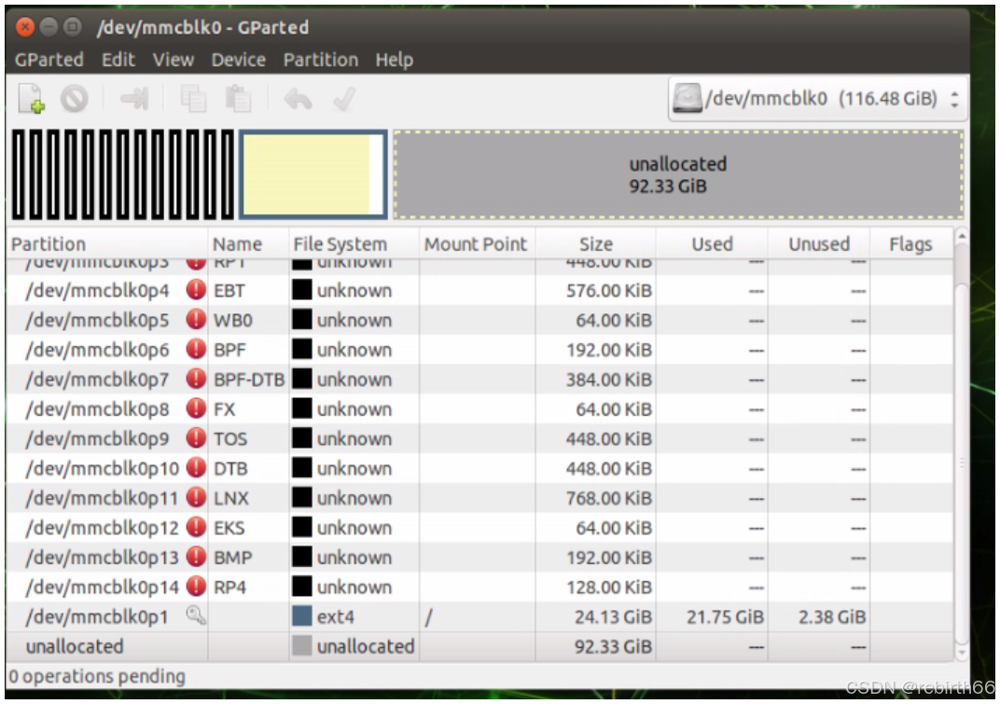
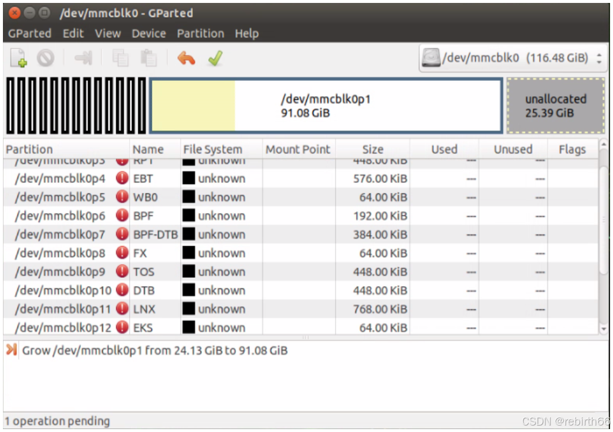
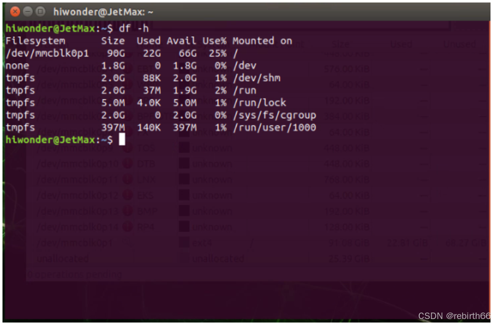

# 边缘计算节点底层环境部署与 SD 卡无损扩容(Jetson-Nano-Environment-Setup)

智能工业物联网系统的边缘节点基础设施部署方案。本项目完整记录了 Jetson Nano 硬件端从零开始的无头（Headless）初始化与局域网网络穿透配置，并重点攻克了系统出厂镜像导致的物理存储空间锁定瓶颈。通过图形化分区管理工具重写底层分区表，实现了 SD 卡根文件系统的动态无损扩容，为后续机械臂控制等业务模块的开发扫清了底层环境依赖障碍。

**具体详细步骤可以访问这个网址，阅读本人当时写的完整的 CSDN 技术复盘报告：**
https://blog.csdn.net/rebirth66/article/details/140751211?spm=1001.2014.3001.5502

### 1、**情景（Situation）：**

- 项目初期，需要为外围机械臂配置基于Jetson Nano 的底层运行环境。系统的部署方式是通过开发者主机将官方镜像文件（`.img`）烧录至 SD 卡，再插入主板启动。
- 实际操作中，我虽然使用了 128GB 的大容量 SD 卡，但在通过远程桌面接入 Linux 系统准备二次开发时，频繁触发“磁盘容量不足”的报错。由于剩余空间被锁死在出厂镜像设定的大小，导致后续的依赖下载与网络配置等开发流程完全阻塞。

### 2、**任务（Task）：**

- 完成从系统烧录、无头（Headless）设备的局域网穿透配置，到彻底解决磁盘空间瓶颈的全链路基础环境搭建。重点是在不损坏已有系统镜像的前提下，将 Linux 根文件系统（Rootfs）扩容至 128GB SD 卡的实际物理容量。

### 3、**行动（Action）：**

- **底层系统初始化：** 在 Windows 宿主机下，先通过磁盘管理和 `SD Card Formatter` 彻底清空并重建卷，随后使用 `Win32 Disk Imager` 将系统镜像完整写入 SD 卡 。
- **无头设备网络配置：** 针对没有外接显示器的 Jetson Nano，我通过 WonderAi APP 直连设备热点获取其分配的局域网 IP（192.168.11.27），再利用 `NoMachine` 软件在电脑端进行远程桌面穿透，成功引导设备接入实验室局域网 。
- **动态无损扩容：**
  - 1. 查阅资料定位问题：烧录工具仅分配了镜像自带的约 24GB 分区，剩余约 92GB 为未分配（Unallocated）状态 。
  - 2. 在 Jetson Nano 端拉取并安装 `gparted` 图形化分区管理工具 。
  - 3. 锁定挂载点 `/dev/mmcblk0p1`（ext4 主分区），利用 GUI 工具将主分区边界向后拉伸，吸收全部 92GB 空闲空间，并重写底层分区表完成无损扩容 。

### 4、**结果（Result）：**

- 扩容完成后，通过 `df -h` 命令在终端验证，根目录 (`/`) 的可用空间从不足 2GB 成功跃升并识别为 90GB，可用空间达 66GB 。彻底扫清了环境依赖无法下载的障碍，保障了后续机械臂通信与控制模块的顺利开发。

### 5、**复盘（Evaluation）：**

- **认知升级：** 打破了纯软件开发的思维惯性，深刻理解了“物理存储介质”与操作系统的“逻辑分区/文件系统”之间的剥离关系。
- **技能沉淀：** 独立跑通了边缘计算设备的完整部署流（宿主机处理 -> 烧录 -> 远程 SSH/VNC 穿透 -> Linux 底层磁盘管理）。这种在没有现成环境下的“拓荒”能力，极大地提升了我的工程排错直觉。

### 6、附加说明（addition）：

- 扩容前状态截图：

  

- 扩容后状态截图：

  

- 命令行验证：

  
